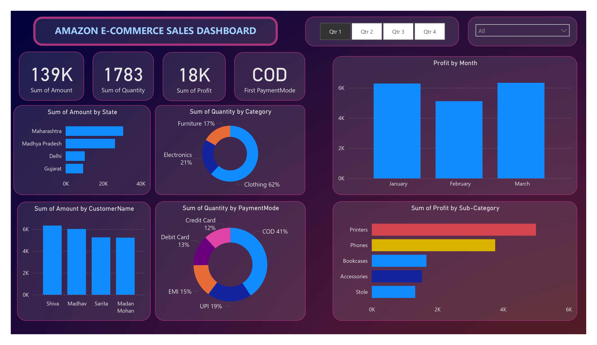

# Amazon E-Commerce Sales Dashboard

This repository contains a Power BI report that analyzes various aspects of Amazon e-commerce sales.

## Overview

This report provides insights into Amazon's e-commerce sales, including:
- **Profit by Month**: A visual representation of monthly profits.
- **Profit by Sub-Category**: Breakdown of profits by different product sub-categories.
- **Quantity by Category**: Distribution of quantities sold across various categories such as Clothing, Furniture, and Electronics.
- **Quantity by Payment Mode**: Analysis of sales quantities based on different payment modes like COD, UPI, EMI, Debit Card, and Credit Card.
- **Amount by State**: Sales amount distribution across different states.
- **Amount by Customer Name**: Top customers by sales amount.

## Key Visuals

- **Profit by Month**: Monthly trends in profit.
- **Profit by Sub-Category**: Breakdown of profits across different product sub-categories.
- **Quantity by Category**: A pie chart depicting the percentage of quantities sold in different categories.
- **Quantity by Payment Mode**: Breakdown of quantities sold by different payment methods.
- **Amount by State**: Visual representation of the total sales amount by state.
- **Amount by Customer Name**: Identifies the top customers contributing to sales.

## Getting Started

To view this report, you can either download the `.pbix` file and open it using Power BI Desktop or view the PDF file for a snapshot of the report.

### Prerequisites

- [Power BI Desktop](https://powerbi.microsoft.com/desktop/) - Required to open the `.pbix` file.

## Repository Structure

- `Sales Report.pbix`: The Power BI report file (to be added).
- `sales_report.pdf`: PDF version of the report.

## Contributing

Feel free to fork this repository and make contributions. Pull requests are welcome.

## License

This project is licensed under the MIT License - see the [LICENSE](LICENSE) file for details.
